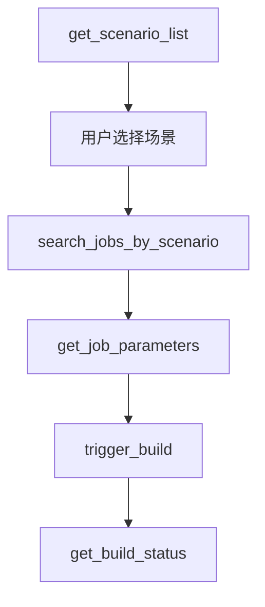
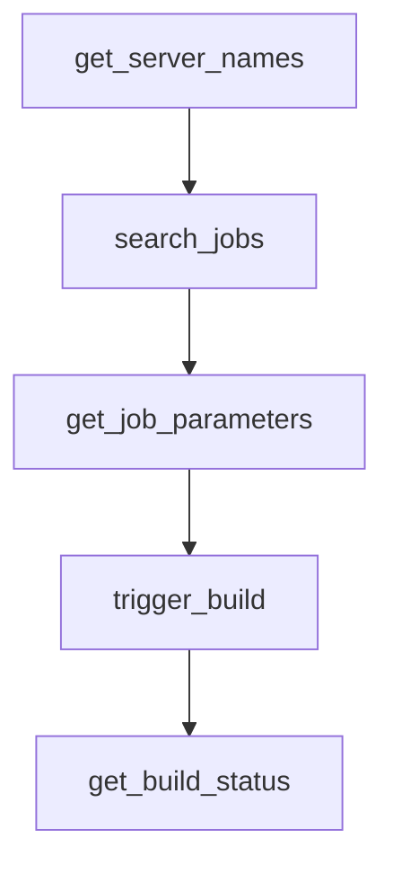
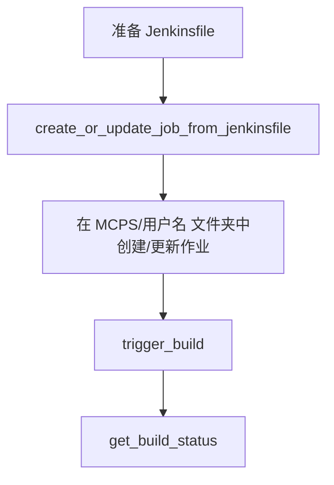

# Jenkins MCP 工具

[]()
[]()
[]()

## 🚀 介绍

Jenkins MCP 是基于 FastMCP 框架开发的企业级多 Jenkins 服务器管理和自动化工具，专为 DevOps 流程设计。支持智能场景映射、多服务器管理、完整的 CI/CD 生命周期操作和动态作业创建。

## ✨ 核心功能

### 🏢 多服务器管理
- **动态配置**：支持配置和动态增删多个 Jenkins 服务器
- **环境隔离**：支持开发、测试、生产等多环境管理
- **安全认证**：支持 token 和环境变量的认证方式

### 🎯 智能场景映射
- **预配置场景**：内置常用 DevOps 场景（用户权限同步、应用部署、镜像同步）
- **智能推荐**：根据场景自动选择服务器和作业路径
- **个性化指引**：每个场景提供定制化的操作指引

### ⚙️ 完整 CI/CD 支持
- **作业搜索**：支持跨多级目录的模糊和精确搜索
- **参数化构建**：自动检测和验证必需参数
- **实时监控**：构建状态查询和日志获取
- **构建控制**：支持构建触发、停止和管理
- **作业创建**：从 Jenkinsfile 创建/更新 Jenkins 作业，自动目录管理

### 🔧 开发者友好
- **MCP 标准**：符合 Model Context Protocol 规范
- **容器化**：容器化部署，易于集成
- **多种操作模式**：支持 stdio、SSE 和 HTTP 传输模式

## ⚙️ 配置指南

### 📁 配置文件结构

创建 `config.yaml` 文件来配置 Jenkins 服务器和应用场景：

```yaml
# Jenkins 服务器配置
servers:
  - name: maglev-sre           # 服务器别名
    uri: https://jenkins.server
    user: xhuaustc@gmail.com
    tokenEnv: JENKINS_TOKEN  # 推荐：从环境变量获取 token


# 预配置应用场景
scenarios:
  "同步用户权限":
    description: "用户权限同步场景"
    server: "shlab"
    job_path: "maglev/tool/permission-replicate/"
    prompt_template: "执行用户权限同步任务。作业路径: {job_path}。请确认要同步哪些用户的权限？"

  "部署应用":
    description: "应用部署场景，支持 diff/sync/build 操作"
    server: "maglev-sre"
    job_path: "release/deploy/"
    prompt_template: "执行应用部署任务。作业路径: {job_path}。请确认要部署的应用名称、版本和环境？"

  "同步镜像到 mldc":
    description: "同步容器镜像到 mldc 环境"
    server: "shlab"
    job_path: "mldc-prod/sync-container-image-to-docker-af"
    prompt_template: "执行镜像同步任务。请提供要同步的镜像地址？"
```

### 🔐 安全配置

**推荐：** 使用环境变量管理敏感信息
```bash
export PROD_BLSM_JENKINS_TOKEN="your-production-token"
export SHLAB_JENKINS_TOKEN="your-shlab-token"
```

**配置优先级：**
1. 环境变量（`tokenEnv` 指定的变量名）
2. 直接配置（`token` 字段）
3. 交互式输入（如果都没有配置）

## 🚀 快速开始

### 🐳 Docker 方式（推荐）

#### 1. 构建镜像
```bash
cd mcps/jenkins
docker build -t jenkins-mcp .
```

#### 2. 准备配置
创建 `config.yaml` 文件（参考上面的配置指南）

#### 3. 运行容器
```bash
# 使用当前目录的配置文件
docker run -i --rm \
  -v ./config.yaml:/app/config.yaml \
  -e PROD_BLSM_JENKINS_TOKEN="${PROD_BLSM_JENKINS_TOKEN}" \
  -e SHLAB_JENKINS_TOKEN="${SHLAB_JENKINS_TOKEN}" \
  jenkins-mcp

# 或指定自定义配置路径
docker run -i --rm \
  -v /path/to/your/config.yaml:/app/config.yaml \
  -e JENKINS_TOKEN="${JENKINS_TOKEN}" \
  jenkins-mcp
```

### 🎨 MCP 客户端集成

#### Cursor 集成

1. **设置环境变量：**
   ```bash
   export JENKINS_TOKEN="your-jenkins-token"
   ```

2. **创建配置文件：**
   在项目根目录创建 `jenkins-config.yaml`：
   ```yaml
   servers:
     - name: your-jenkins
       uri: https://your-jenkins.company.com
       user: your-username
       tokenEnv: JENKINS_TOKEN
   scenarios:
     "部署应用":
       description: "应用部署场景"
       server: "your-jenkins"
       job_path: "deploy/"
   ```

3. **配置 Cursor MCP 设置：**
   添加到 Cursor 的 MCP 配置：
   ```json
   {
     "mcpServers": {
       "jenkins": {
         "command": "docker",
         "args": [
           "run", "--rm", "-i",
           "-v", "/path/to/your/jenkins-config.yaml:/app/config.yaml",
           "-e", "JENKINS_TOKEN=${JENKINS_TOKEN}",
           "jenkins-mcp"
         ],
         "env": {
           "JENKINS_TOKEN": "your-jenkins-token"
         }
       }
     }
   }
   ```

4. **使用示例：**
   在 Cursor 中询问：
   ```
   "获取可用的 Jenkins 场景列表"
   "触发部署应用的构建"
   "检查最新构建的状态"
   "从 Jenkinsfile 创建新的测试作业"
   ```

#### 方法 2：本地安装

1. **安装依赖：**
   ```bash
   cd mcps/jenkins
   pip install -e .
   ```

2. **配置 Cursor MCP 设置：**
   ```json
   {
     "mcpServers": {
      "command": "docker",
      "args": [
        "run",
        "-i",
        "--rm",
        "-v",
        "~/.jenkinscliconfig:/app/config.yaml",
        "docker.io/mpan083/jenkins-mcp"
      ]
    }
     }
   }
   ```

### 🔧 命令行参数

Jenkins MCP 支持以下命令行参数：

```bash
# 基本用法
jenkins [options]

# 可用选项：
  --transport {stdio,sse,http}  # 传输模式（默认：stdio）
  --host HOST                   # 绑定主机（默认：0.0.0.0）
  --port PORT                   # 绑定端口（默认：8000）
  --config, -c CONFIG           # 配置文件路径
  --scenarios, -s SCENARIOS     # 场景文件路径

# 使用示例：
jenkins --config my-config.yaml --scenarios my-scenarios.yaml
jenkins --transport sse --port 8080 --scenarios custom-scenarios.yaml
```

### 🔧 传统启动方式

```bash
# 本地开发
python -m jenkins --transport stdio

# 使用自定义配置和场景
python -m jenkins --config config.yaml --scenarios scenarios.yaml

# Web 服务
uvicorn jenkins.server:server --reload --host 0.0.0.0 --port 8000
```

## 📋 可用工具 (11个)

### 🔧 服务器管理
| 工具                        | 描述                                  | 参数 |
| --------------------------- | ------------------------------------- | ---- |
| `get_server_names()`        | 获取所有可用 Jenkins 服务器的名称列表 | 无   |
| `validate_jenkins_config()` | 验证 Jenkins 配置的完整性             | 无   |

### 🎯 智能场景（推荐工作流）
| 工具                                | 描述                      | 参数                 |
| ----------------------------------- | ------------------------- | -------------------- |
| `get_scenario_list()`               | 获取所有可用场景          | 无                   |
| `search_jobs_by_scenario(scenario)` | 根据场景搜索 Jenkins 作业 | `scenario`: 场景名称 |

### 🔍 作业搜索和管理
| 工具                                             | 描述                            | 参数                                                   |
| ------------------------------------------------ | ------------------------------- | ------------------------------------------------------ |
| `search_jobs(server_name, keyword)`              | 在指定服务器上搜索 Jenkins 作业 | `server_name`: 服务器名称<br>`keyword`: 搜索关键词     |
| `get_job_parameters(server_name, job_full_name)` | 获取作业参数定义                | `server_name`: 服务器名称<br>`job_full_name`: 作业名称 |

### ⚙️ 构建管理
| 工具                                                         | 描述              | 参数                                                                                 |
| ------------------------------------------------------------ | ----------------- | ------------------------------------------------------------------------------------ |
| `trigger_build(server_name, job_full_name, params)`          | 触发 Jenkins 构建 | `server_name`: 服务器名称<br>`job_full_name`: 作业名称<br>`params`: 构建参数（可选） |
| `get_build_status(server_name, job_full_name, build_number)` | 获取构建状态      | `server_name`: 服务器名称<br>`job_full_name`: 作业名称<br>`build_number`: 构建编号   |
| `stop_build(server_name, job_full_name, build_number)`       | 停止 Jenkins 构建 | `server_name`: 服务器名称<br>`job_full_name`: 作业名称<br>`build_number`: 构建编号   |
| `get_build_log(server_name, job_full_name, build_number)`    | 获取构建日志      | `server_name`: 服务器名称<br>`job_full_name`: 作业名称<br>`build_number`: 构建编号   |

### 🚀 作业创建和管理
| 工具                                                                                                          | 描述                                   | 参数                                                                                                                                                                 |
| ------------------------------------------------------------------------------------------------------------- | -------------------------------------- | -------------------------------------------------------------------------------------------------------------------------------------------------------------------- |
| `create_or_update_job_from_jenkinsfile(server_name, job_name, jenkinsfile_content, description, folder_path)` | 从 Jenkinsfile 创建或更新 Jenkins 作业 | `server_name`: 服务器名称<br>`job_name`: 作业名称<br>`jenkinsfile_content`: Jenkinsfile 内容<br>`description`: 作业描述（可选）<br>`folder_path`: 文件夹路径（可选） |

### 🚀 推荐工作流

#### 基于场景的部署（推荐）


#### 通用作业搜索


#### 作业创建工作流


### 💡 使用示例

#### 基于场景的部署示例
```bash
# 1. 获取可用场景
"获取可用的 Jenkins 场景列表"

# 2. 选择场景并搜索作业
"搜索'同步镜像到 mldc'场景的作业"

# 3. 触发构建
"触发镜像同步任务，镜像地址为 docker.io/user/app:latest"
```

#### 直接操作示例
```bash
# 1. 查看可用服务器
"显示所有可用的 Jenkins 服务器"

# 2. 搜索作业
"在 shlab 服务器上搜索包含 'deploy' 的作业"

# 3. 获取参数并触发
"获取作业 'release/deploy/app' 的参数定义"
"使用参数触发构建: {'APP_NAME': 'myapp', 'VERSION': '1.0.0'}"
```

#### 作业创建示例
```bash
# 1. 创建新的测试作业
"在 shlab 服务器上创建名为 'my-test-job' 的新 Jenkins 作业，使用以下 Jenkinsfile：
pipeline {
    agent any
    stages {
        stage('Test') {
            steps {
                echo 'Hello World'
            }
        }
    }
}"

# 2. 更新现有作业
"更新 'my-test-job' 作业，使用包含部署步骤的新 Jenkinsfile"
```

### 🔍 增强的作业信息

在搜索或获取作业信息时，返回以下详细信息：
- **基本信息**：作业名称、完整名称、URL、描述
- **状态**：可构建状态、颜色指示器、参数化状态
- **构建历史**：最新构建编号、最新构建 URL
- **参数**：完整的参数定义，包含类型和默认值

### 🏗️ 作业创建功能

#### 自动目录管理
- **用户组织**：所有创建的作业都组织在 `MCPS/{用户名}/` 目录下
- **用户名提取**：自动从 Jenkins 服务器配置中提取用户名（处理邮箱格式）
- **文件夹创建**：自动创建必要的文件夹结构
- **嵌套文件夹**：支持在嵌套文件夹路径中创建作业

#### 作业创建流程
1. **文件夹结构**：作业在 `MCPS/{用户名}/{可选文件夹路径}/` 中创建
2. **冲突处理**：自动检测现有作业并更新配置
3. **流水线作业**：创建启用沙箱安全的流水线作业
4. **错误恢复**：针对文件夹创建和作业更新的健壮错误处理

## 🎯 预配置场景

Jenkins MCP 内置 **3** 个常用 DevOps 场景：

| 场景                | 描述                                    | 服务器     | 作业路径                                      |
| ------------------- | --------------------------------------- | ---------- | --------------------------------------------- |
| **同步用户权限**    | 用户权限同步场景                        | shlab      | `maglev/tool/permission-replicate/`           |
| **部署应用**        | 应用部署场景，支持 diff/sync/build 操作 | maglev-sre | `release/deploy/`                             |
| **同步镜像到 mldc** | 同步容器镜像到 mldc 环境                | shlab      | `mldc-prod/sync-container-image-to-docker-af` |

### 🎨 自定义场景配置

#### 📁 场景文件支持

Jenkins MCP 支持多种配置自定义场景的方式：

1. **独立场景文件**（推荐）：
   ```bash
   # 创建自定义场景文件
   cp scenarios.example.yaml scenarios.yaml
   
   # 启动时指定场景文件
   jenkins --scenarios scenarios.yaml
   ```

2. **环境变量：**
   ```bash
   export JENKINS_MCP_SCENARIOS_FILE="/path/to/my-scenarios.yaml"
   jenkins
   ```

3. **在 config.yaml 中配置：**
   ```yaml
   scenarios:
     "自定义部署":
       description: "自定义应用部署场景"
       server: "your-jenkins"
       job_path: "custom/deploy/"
       prompt_template: "执行自定义部署任务。请确认部署参数？"
   ```

#### 🔄 场景合并规则

- **默认场景**：从 `scenarios.default.yaml` 加载内置场景
- **用户场景**：从自定义场景文件加载
- **合并策略**：用户场景优先，同名场景覆盖默认场景

#### 📝 场景文件示例

创建 `scenarios.yaml` 文件：
```yaml
scenarios:
  "数据库备份":
    description: "执行数据库备份任务"
    server: "production"
    job_path: "backup/database/"
    prompt_template: "执行数据库备份任务。请选择数据库和备份类型？"

  "性能测试":
    description: "运行应用性能测试"
    server: "test"
    job_path: "test/performance/"
    prompt_template: "执行性能测试。请选择测试场景和负载参数？"

  # 覆盖默认场景
  "部署应用":
    description: "我的自定义部署流程"
    server: "my-jenkins"
    job_path: "custom/deploy/"
    prompt_template: "执行自定义部署。请确认部署配置？"
```

## 🧪 测试

### 单元测试
```bash
cd mcps/jenkins
pytest tests/ -v
```

### Docker 测试
```bash
# 构建和测试
docker build -t jenkins-mcp-test .
docker run --rm jenkins-mcp-test jenkins --help
```

### MCP Inspector 测试
```bash
# 使用 MCP Inspector 测试
npx @modelcontextprotocol/inspector docker run --rm -i -v ./config.yaml:/app/config.yaml jenkins-mcp
```

## 🔧 开发

### 本地开发环境
```bash
# 安装开发依赖
pip install -e ".[dev]"

# 运行代码检查
ruff check src/
mypy src/

# 格式化代码
ruff format src/
```

### 贡献指南
1. Fork 此仓库
2. 创建功能分支 (`git checkout -b feature/amazing-feature`)
3. 提交更改 (`git commit -m 'Add amazing feature'`)
4. 推送到分支 (`git push origin feature/amazing-feature`)
5. 打开 Pull Request

## 📚 文档

- [工具文档](./TOOLS.md) - 完整工具列表和用法
- [FastMCP 文档](https://github.com/jlowin/fastmcp) - MCP 框架文档
- [Model Context Protocol](https://modelcontextprotocol.io/) - MCP 协议标准

## 🆘 故障排除

### 常见问题

**问：连接 Jenkins 服务器失败？**  
答：检查网络、URL 和认证信息。使用 `validate_jenkins_config()` 验证配置。

**问：构建参数验证失败？**  
答：使用 `get_job_parameters()` 检查必需参数，确保提供所有参数。

**问：Docker 容器启动失败？**  
答：检查配置文件挂载路径和环境变量设置。

**问：作业创建失败，出现 500 错误？**  
答：检查 Jenkins 权限和 CSRF 设置。工具会自动处理 CSRF token。

**问：无法在指定文件夹中创建作业？**  
答：确保您有创建文件夹和作业的权限。作业会自动组织在 `MCPS/{用户名}/` 下。

### 日志调试
```bash
# 启用详细日志
export JENKINS_MCP_LOG_LEVEL=DEBUG
jenkins --transport stdio
```

### 性能优化
- **多级目录支持**：高效处理嵌套 Jenkins 文件夹
- **智能参数检测**：通过智能缓存减少 API 调用
- **CSRF Token 管理**：自动处理安全 Jenkins 实例的 token

## 📄 许可证

此项目根据 MIT 许可证授权 - 查看 [LICENSE](LICENSE) 文件了解详情。

## 🤝 支持

如果您有问题或建议：
1. 查看 [Issues](../../issues) 中的已知问题
2. 创建新的 [Issue](../../issues/new) 报告问题
3. 联系开发团队获取支持

---

**Jenkins MCP** - 让 Jenkins 自动化更简单 🚀