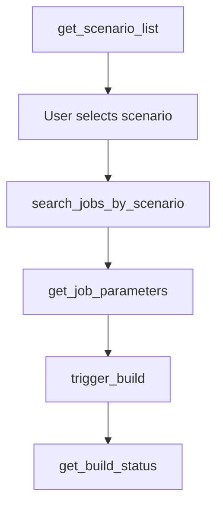
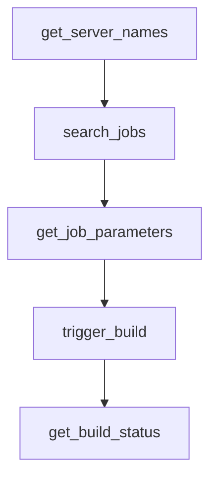
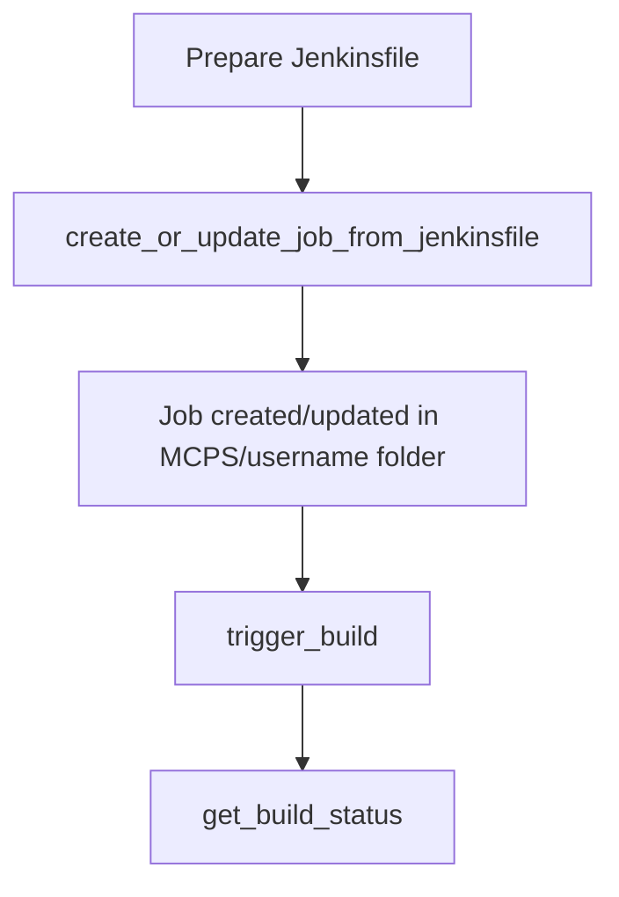

# Jenkins MCP Tool

[]()
[]()
[]()

## 🚀 Introduction

Jenkins MCP is an multi-Jenkins server management and automation tool developed based on the FastMCP framework, designed for DevOps processes. It supports intelligent scenario mapping, multi-server management, complete CI/CD lifecycle operations, and dynamic job creation.

## ✨ Core Features

### 🏢 Multi-Server Management
- **Dynamic Configuration**: Supports configuration and dynamic addition/removal of multiple Jenkins servers
- **Environment Isolation**: Supports management of multiple environments such as development, testing, and production
- **Secure Authentication**: Supports token and environment variable-based authentication

### 🎯 Intelligent Scenario Mapping
- **Pre-configured Scenarios**: Built-in common DevOps scenarios (user permission sync, app deployment, image sync)
- **Smart Recommendation**: Automatically selects server and job path based on scenario
- **Personalized Guidance**: Each scenario provides customized operation guidance

### ⚙️ Full CI/CD Support
- **Job Search**: Supports fuzzy and exact search across multi-level directories
- **Parameterized Build**: Automatically detects and validates required parameters
- **Real-time Monitoring**: Build status query and log retrieval
- **Build Control**: Supports build trigger, stop, and management
- **Job Creation**: Create/update Jenkins jobs from Jenkinsfile with automatic directory management

### 🔧 Developer Friendly
- **MCP Standard**: Complies with Model Context Protocol specification
- **Dockerized**: Containerized deployment for easy integration
- **Multiple Operation Modes**: Supports stdio, SSE, and HTTP transport modes

## ⚙️ Configuration Guide

### 📁 Config File Structure

Create a `config.yaml` file to configure Jenkins servers and application scenarios:

```yaml
# Jenkins server configuration
servers:
  - name: maglev-sre           # Server alias
    uri: https://jenkins.server
    user: xhuaustc@gmail.com
    tokenEnv: JENKINS_TOKEN  # Recommended: get token from environment variable

# Pre-configured application scenarios
scenarios:
  "Sync User Permissions":
    description: "User permission sync scenario"
    server: "shlab"
    job_path: "maglev/tool/permission-replicate/"
    prompt_template: "Execute user permission sync task. Job path: {job_path}. Please confirm which users' permissions to sync?"

  "Deploy Application":
    description: "Application deployment scenario, supports diff/sync/build operations"
    server: "maglev-sre"
    job_path: "release/deploy/"
    prompt_template: "Execute application deployment task. Job path: {job_path}. Please confirm the app name, version, and environment to deploy?"

  "Sync Image to mldc":
    description: "Sync container image to mldc environment"
    server: "shlab"
    job_path: "mldc-prod/sync-container-image-to-docker-af"
    prompt_template: "Execute image sync task. Please provide the image address to sync?"
```

### 🔐 Security Configuration

**Recommended:** Use environment variables to manage sensitive information
```bash
export PROD_BLSM_JENKINS_TOKEN="your-production-token"
export SHLAB_JENKINS_TOKEN="your-shlab-token"
```

**Configuration Priority:**
1. Environment variable (variable name specified by `tokenEnv`)
2. Direct configuration (`token` field)
3. Interactive input (if neither is configured)

## 🚀 Quick Start

### 🐳 Docker Method (Recommended)

#### 1. Build Image
```bash
cd mcps/jenkins
docker build -t jenkins-mcp .
```

#### 2. Prepare Configuration
Create a `config.yaml` file (refer to the configuration guide above)

#### 3. Run Container
```bash
# Use config file from current directory
docker run -i --rm \
  -v ./config.yaml:/app/config.yaml \
  -e PROD_BLSM_JENKINS_TOKEN="${PROD_BLSM_JENKINS_TOKEN}" \
  -e SHLAB_JENKINS_TOKEN="${SHLAB_JENKINS_TOKEN}" \
  jenkins-mcp

# Or specify custom config path
docker run -i --rm \
  -v /path/to/your/config.yaml:/app/config.yaml \
  -e JENKINS_TOKEN="${JENKINS_TOKEN}" \
  jenkins-mcp
```

### 🎨 MCP Client Integration

#### Cursor Integration

1. **Set Environment Variables:**
   ```bash
   export JENKINS_TOKEN="your-jenkins-token"
   ```

2. **Create Config File:**
   Create `jenkins-config.yaml` in the project root:
   ```yaml
   servers:
     - name: your-jenkins
       uri: https://your-jenkins.company.com
       user: your-username
       tokenEnv: JENKINS_TOKEN
   scenarios:
     "Deploy Application":
       description: "Application deployment scenario"
       server: "your-jenkins"
       job_path: "deploy/"
   ```

3. **Configure Cursor MCP Settings:**
   Add to Cursor's MCP config:
   ```json
   {
     "mcpServers": {
       "jenkins": {
         "command": "docker",
         "args": [
           "run", "--rm", "-i",
           "-v", "/path/to/your/jenkins-config.yaml:/app/config.yaml",
           "-e", "JENKINS_TOKEN=${JENKINS_TOKEN}",
           "docker.io/mpan083/jenkins-mcp"
         ],
         "env": {
           "JENKINS_TOKEN": "your-jenkins-token"
         }
       }
     }
   }
   ```

4. **Usage Example:**
   In Cursor, ask:
   ```
   "Get the list of available Jenkins scenarios"
   "Trigger a build for Deploy Application"
   "Check the status of the latest build"
   "Create a new test job from Jenkinsfile"
   ```

#### Method 2: Local Installation

1. **Install Dependencies:**
   ```bash
   cd mcps/jenkins
   pip install -e .
   ```

2. **Configure Cursor MCP Settings:**
   ```json
   {
     "mcpServers": {
      "command": "docker",
      "args": [
        "run",
        "-i",
        "--rm",
        "-v",
        "~/.jenkinscliconfig:/app/config.yaml",
        "docker.io/mpan083/jenkins-mcp"
      ]
    }
     }
   }
   ```

### 🔧 Command Line Arguments

Jenkins MCP supports the following command line arguments:

```bash
# Basic usage
jenkins [options]

# Available options:
  --transport {stdio,sse,http}  # Transport mode (default: stdio)
  --host HOST                   # Bind host (default: 0.0.0.0)
  --port PORT                   # Bind port (default: 8000)
  --config, -c CONFIG           # Config file path
  --scenarios, -s SCENARIOS     # Scenario file path

# Usage examples:
jenkins --config my-config.yaml --scenarios my-scenarios.yaml
jenkins --transport sse --port 8080 --scenarios custom-scenarios.yaml
```

### 🔧 Traditional Startup

```bash
# Local development
python -m jenkins --transport stdio

# Use custom config and scenarios
python -m jenkins --config config.yaml --scenarios scenarios.yaml

# Web service
uvicorn jenkins.server:server --reload --host 0.0.0.0 --port 8000
```

## 📋 Available Tools (11)

### 🔧 Server Management
| Tool                        | Description                                   | Params |
| --------------------------- | --------------------------------------------- | ------ |
| `get_server_names()`        | Get the list of all available Jenkins servers | None   |
| `validate_jenkins_config()` | Validate the integrity of Jenkins config      | None   |

### 🎯 Intelligent Scenarios (Recommended Workflow)
| Tool                                | Description                     | Params                    |
| ----------------------------------- | ------------------------------- | ------------------------- |
| `get_scenario_list()`               | Get all available scenarios     | None                      |
| `search_jobs_by_scenario(scenario)` | Search Jenkins jobs by scenario | `scenario`: scenario name |

### 🔍 Job Search and Management
| Tool                                             | Description                     | Params                                                  |
| ------------------------------------------------ | ------------------------------- | ------------------------------------------------------- |
| `search_jobs(server_name, keyword)`              | Search Jenkins jobs on a server | `server_name`: server name<br>`keyword`: search term    |
| `get_job_parameters(server_name, job_full_name)` | Get job parameter definitions   | `server_name`: server name<br>`job_full_name`: job name |

### ⚙️ Build Management
| Tool                                                         | Description           | Params                                                                                       |
| ------------------------------------------------------------ | --------------------- | -------------------------------------------------------------------------------------------- |
| `trigger_build(server_name, job_full_name, params)`          | Trigger Jenkins build | `server_name`: server name<br>`job_full_name`: job name<br>`params`: build params (optional) |
| `get_build_status(server_name, job_full_name, build_number)` | Get build status      | `server_name`: server name<br>`job_full_name`: job name<br>`build_number`: build number      |
| `stop_build(server_name, job_full_name, build_number)`       | Stop Jenkins build    | `server_name`: server name<br>`job_full_name`: job name<br>`build_number`: build number      |
| `get_build_log(server_name, job_full_name, build_number)`    | Get build log         | `server_name`: server name<br>`job_full_name`: job name<br>`build_number`: build number      |

### 🚀 Job Creation and Management
| Tool                                                                                                          | Description                                   | Params                                                                                                                                                                                 |
| ------------------------------------------------------------------------------------------------------------- | --------------------------------------------- | -------------------------------------------------------------------------------------------------------------------------------------------------------------------------------------- |
| `create_or_update_job_from_jenkinsfile(server_name, job_name, jenkinsfile_content, description, folder_path)` | Create or update Jenkins job from Jenkinsfile | `server_name`: server name<br>`job_name`: job name<br>`jenkinsfile_content`: Jenkinsfile content<br>`description`: job description (optional)<br>`folder_path`: folder path (optional) |

### 🚀 Recommended Workflow

#### Scenario-based Deployment (Recommended)


#### General Job Search


#### Job Creation Workflow


### 💡 Usage Examples

#### Scenario-based Deployment Example
```bash
# 1. Get available scenarios
"Get the list of available Jenkins scenarios"

# 2. Select scenario and search jobs
"Search jobs for the 'Sync Image to mldc' scenario"

# 3. Trigger build
"Trigger image sync task, image address is docker.io/user/app:latest"
```

#### Direct Operation Example
```bash
# 1. View available servers
"Show all available Jenkins servers"

# 2. Search jobs
"Search for jobs containing 'deploy' on the shlab server"

# 3. Get parameters and trigger
"Get parameter definitions for job 'release/deploy/app'"
"Trigger build with parameters: {'APP_NAME': 'myapp', 'VERSION': '1.0.0'}"
```

#### Job Creation Example
```bash
# 1. Create a new test job
"Create a new Jenkins job named 'my-test-job' on shlab server with this Jenkinsfile:
pipeline {
    agent any
    stages {
        stage('Test') {
            steps {
                echo 'Hello World'
            }
        }
    }
}"

# 2. Update existing job
"Update the 'my-test-job' with a new Jenkinsfile that includes deployment steps"
```

### 🔍 Enhanced Job Information

When searching or getting job information, the following details are returned:
- **Basic Info**: Job name, full name, URL, description
- **Status**: Buildable status, color indicator, parameterization status
- **Build History**: Last build number, last build URL
- **Parameters**: Complete parameter definitions with types and default values

### 🏗️ Job Creation Features

#### Automatic Directory Management
- **User Organization**: All created jobs are organized under `MCPS/{username}/` directory
- **Username Extraction**: Automatically extracts username from Jenkins server configuration (handles email formats)
- **Folder Creation**: Automatically creates necessary folder structure
- **Nested Folders**: Supports creating jobs in nested folder paths

#### Job Creation Process
1. **Folder Structure**: Jobs are created in `MCPS/{username}/{optional_folder_path}/`
2. **Conflict Handling**: Automatically detects existing jobs and updates configuration
3. **Pipeline Jobs**: Creates pipeline jobs with sandbox security enabled
4. **Error Recovery**: Robust error handling for folder creation and job updates

## 🎯 Pre-configured Scenarios

Jenkins MCP comes with **3** common DevOps scenarios:

| Scenario                  | Description                                      | Server     | Job Path                                      |
| ------------------------- | ------------------------------------------------ | ---------- | --------------------------------------------- |
| **Sync User Permissions** | User permission sync scenario                    | shlab      | `maglev/tool/permission-replicate/`           |
| **Deploy Application**    | Application deployment, supports diff/sync/build | maglev-sre | `release/deploy/`                             |
| **Sync Image to mldc**    | Sync container image to mldc environment         | shlab      | `mldc-prod/sync-container-image-to-docker-af` |

### 🎨 Custom Scenario Configuration

#### 📁 Scenario File Support

Jenkins MCP supports multiple ways to configure custom scenarios:

1. **Standalone Scenario File** (Recommended):
   ```bash
   # Create custom scenario file
   cp scenarios.example.yaml scenarios.yaml
   
   # Specify scenario file at startup
   jenkins --scenarios scenarios.yaml
   ```

2. **Environment Variable:**
   ```bash
   export JENKINS_MCP_SCENARIOS_FILE="/path/to/my-scenarios.yaml"
   jenkins
   ```

3. **Configure in config.yaml:**
   ```yaml
   scenarios:
     "Custom Deployment":
       description: "Custom application deployment scenario"
       server: "your-jenkins"
       job_path: "custom/deploy/"
       prompt_template: "Execute custom deployment task. Please confirm deployment parameters?"
   ```

#### 🔄 Scenario Merge Rules

- **Default Scenarios**: Load built-in scenarios from `scenarios.default.yaml`
- **User Scenarios**: Load from custom scenario file
- **Merge Strategy**: User scenarios take precedence, same-name scenarios override defaults

#### 📝 Scenario File Example

Create a `scenarios.yaml` file:
```yaml
scenarios:
  "Database Backup":
    description: "Execute database backup task"
    server: "production"
    job_path: "backup/database/"
    prompt_template: "Execute database backup task. Please select the database and backup type?"

  "Performance Test":
    description: "Run application performance test"
    server: "test"
    job_path: "test/performance/"
    prompt_template: "Execute performance test. Please select test scenario and load parameters?"

  # Override default scenario
  "Deploy Application":
    description: "My custom deployment process"
    server: "my-jenkins"
    job_path: "custom/deploy/"
    prompt_template: "Execute custom deployment. Please confirm deployment configuration?"
```

## 🧪 Testing

### Unit Tests
```bash
cd mcps/jenkins
pytest tests/ -v
```

### Docker Test
```bash
# Build and test
docker build -t jenkins-mcp-test .
docker run --rm jenkins-mcp-test jenkins --help
```

### MCP Inspector Testing
```bash
# Test with MCP Inspector
npx @modelcontextprotocol/inspector docker run --rm -i -v ./config.yaml:/app/config.yaml jenkins-mcp
```

## 🔧 Development

### Local Development Environment
```bash
# Install development dependencies
pip install -e ".[dev]"

# Run code checks
ruff check src/
mypy src/

# Format code
ruff format src/
```

### Contribution Guide
1. Fork this repository
2. Create a feature branch (`git checkout -b feature/amazing-feature`)
3. Commit your changes (`git commit -m 'Add amazing feature'`)
4. Push to the branch (`git push origin feature/amazing-feature`)
5. Open a Pull Request

## 📚 Documentation

- [Tool Documentation](./TOOLS.md) - Complete tool list and usage
- [FastMCP Documentation](https://github.com/jlowin/fastmcp) - MCP framework docs
- [Model Context Protocol](https://modelcontextprotocol.io/) - MCP protocol standard

## 🆘 Troubleshooting

### Common Issues

**Q: Failed to connect to Jenkins server?**  
A: Check network, URL, and authentication info. Use `validate_jenkins_config()` to validate config.

**Q: Build parameter validation failed?**  
A: Use `get_job_parameters()` to check required parameters and ensure all are provided.

**Q: Docker container failed to start?**  
A: Check config file mount path and environment variable settings.

**Q: Job creation failed with 500 error?**  
A: Check Jenkins permissions and CSRF settings. The tool automatically handles CSRF tokens.

**Q: Cannot create job in specified folder?**  
A: Ensure you have permission to create folders and jobs. Jobs are automatically organized under `MCPS/{username}/`.

### Log Debugging
```bash
# Enable detailed logs
export JENKINS_MCP_LOG_LEVEL=DEBUG
jenkins --transport stdio
```

### Performance Optimization
- **Multi-level Directory Support**: Efficiently handles nested Jenkins folders
- **Intelligent Parameter Detection**: Reduces API calls through smart caching
- **CSRF Token Management**: Automatic token handling for secure Jenkins instances

## 📄 License

This project is licensed under the MIT License - see the [LICENSE](LICENSE) file for details.

## 🤝 Support

If you have questions or suggestions:
1. Check known issues in [Issues](../../issues)
2. Create a new [Issue](../../issues/new) to report problems
3. Contact the development team for support

---

**Jenkins MCP** - Make Jenkins automation easier 🚀