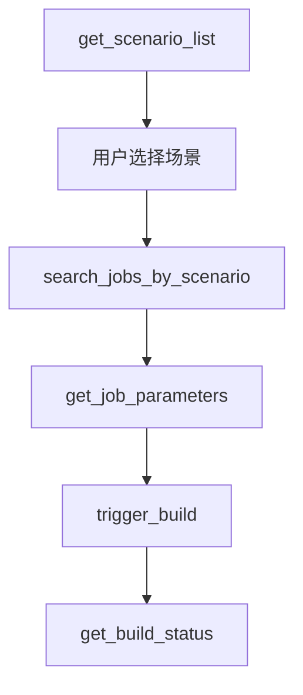
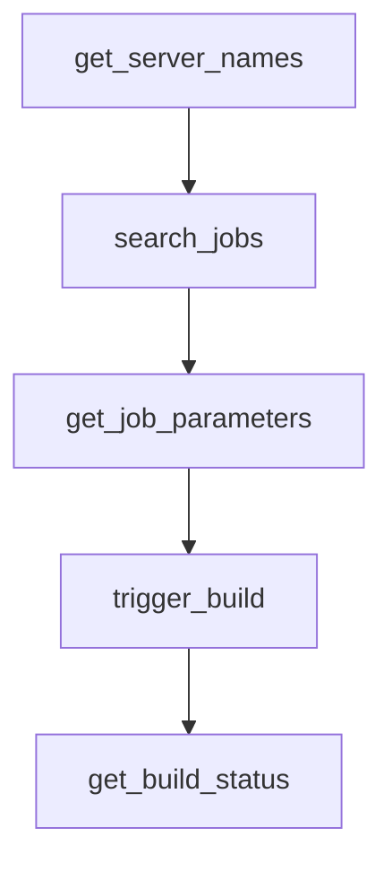
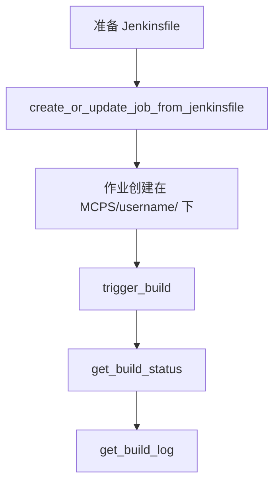

# Jenkins MCP 工具文档

## 📋 可用工具 (11个)

### 🔧 服务器管理

#### 1. `get_server_names()` 
**描述：** 获取所有可用 Jenkins 服务器的名称列表  
**参数：** 无  
**返回：** `List[str]` - 服务器名称列表  
**示例：**
```python
servers = get_server_names()
# 返回: ["maglev-sre", "shlab", "production"]
```

#### 2. `validate_jenkins_config()`
**描述：** 验证 Jenkins 配置的完整性  
**参数：** 无  
**返回：** `dict` - 验证结果  
**示例：**
```python
result = validate_jenkins_config()
# 返回: {"status": "valid", "errors": [], "servers_count": 2}
```

### 🎯 智能场景（推荐工作流）

#### 3. `get_scenario_list()`
**描述：** 获取所有可用的应用场景列表（部署任务首选入口点）  
**参数：** 无  
**返回：** `List[ScenarioInfo]` - 场景信息列表  
**示例：**
```python
scenarios = get_scenario_list()
# 返回场景列表，包含名称、描述、服务器和作业路径
```

#### 4. `search_jobs_by_scenario(scenario: str)`
**描述：** 根据场景直接获取指定的 Jenkins 作业  
**参数：**
- `scenario` (str): 场景名称或索引  
**返回：** `List[JobInfo]` - 匹配的作业信息列表  
**示例：**
```python
jobs = search_jobs_by_scenario("Deploy Application")
# 返回匹配场景的作业列表
```

### 🔍 作业搜索和管理

#### 5. `search_jobs(server_name: str, keyword: str)`
**描述：** 在指定服务器上搜索 Jenkins 作业，支持多级目录  
**参数：**
- `server_name` (str): Jenkins 服务器名称  
- `keyword` (str): 搜索关键词  
**返回：** `List[JobInfo]` - 匹配的作业信息列表  
**示例：**
```python
jobs = search_jobs("shlab", "deploy")
# 搜索 shlab 服务器上包含 "deploy" 的所有作业
```

**作业信息包含：**
- `name`: 作业名称
- `fullName`: 完整作业路径
- `url`: 作业 URL
- `description`: 作业描述
- `buildable`: 是否可构建
- `color`: 状态颜色
- `is_parameterized`: 是否参数化
- `last_build_number`: 最新构建编号
- `last_build_url`: 最新构建 URL

#### 6. `get_job_parameters(server_name: str, job_full_name: str)`
**描述：** 获取 Jenkins 作业的参数定义  
**参数：**
- `server_name` (str): Jenkins 服务器名称  
- `job_full_name` (str): 完整作业名称  
**返回：** `List[JobParameter]` - 参数定义列表  
**示例：**
```python
params = get_job_parameters("shlab", "release/deploy/app")
# 返回作业的所有参数定义，包含类型、默认值、选择项等
```

**参数信息包含：**
- `name`: 参数名称
- `type`: 参数类型（String, Boolean, Choice 等）
- `default`: 默认值
- `choices`: 选择项（Choice 参数）

### ⚙️ 构建管理

#### 7. `trigger_build(server_name: str, job_full_name: str, params: Optional[dict] = None)`
**描述：** 触发 Jenkins 作业构建，自动检测参数需求  
**参数：**
- `server_name` (str): Jenkins 服务器名称  
- `job_full_name` (str): 完整作业名称  
- `params` (dict, 可选): 构建参数字典  
**返回：** `TriggerResult` - 触发结果  
**示例：**
```python
# 无参数构建
result = trigger_build("shlab", "simple/job")

# 参数化构建
result = trigger_build("shlab", "deploy/app", {"APP_NAME": "myapp", "VERSION": "1.0.0"})
```

**智能参数处理：**
- 自动检测作业是否需要参数
- 验证必需参数是否提供
- 支持默认值和选择参数

#### 8. `get_build_status(server_name: str, job_full_name: str, build_number: int)`
**描述：** 获取指定构建编号的 Jenkins 构建状态  
**参数：**
- `server_name` (str): Jenkins 服务器名称  
- `job_full_name` (str): 完整作业名称  
- `build_number` (int): 构建编号  
**返回：** `BuildInfo` - 构建信息  
**示例：**
```python
status = get_build_status("shlab", "deploy/app", 123)
# 返回构建状态、结果、持续时间等信息
```

#### 9. `stop_build(server_name: str, job_full_name: str, build_number: int)`
**描述：** 停止 Jenkins 构建，智能处理权限错误  
**参数：**
- `server_name` (str): Jenkins 服务器名称  
- `job_full_name` (str): 完整作业名称  
- `build_number` (int): 构建编号  
**返回：** `StopResult` - 停止结果  
**示例：**
```python
result = stop_build("shlab", "deploy/app", 123)
# 返回停止状态和操作结果
```

#### 10. `get_build_log(server_name: str, job_full_name: str, build_number: int)`
**描述：** 获取 Jenkins 构建日志  
**参数：**
- `server_name` (str): Jenkins 服务器名称  
- `job_full_name` (str): 完整作业名称  
- `build_number` (int): 构建编号  
**返回：** `str` - 构建日志文本  
**示例：**
```python
log = get_build_log("shlab", "deploy/app", 123)
# 返回完整的构建控制台输出
```

### 🚀 作业创建和管理

#### 11. `create_or_update_job_from_jenkinsfile(server_name: str, job_name: str, jenkinsfile_content: str, description: str = "", folder_path: str = "")`
**描述：** 从 Jenkinsfile 创建或更新 Jenkins 作业  
**参数：**
- `server_name` (str): Jenkins 服务器名称  
- `job_name` (str): 作业名称  
- `jenkinsfile_content` (str): Jenkinsfile 内容  
- `description` (str, 可选): 作业描述  
- `folder_path` (str, 可选): 文件夹路径  
**返回：** `dict` - 创建/更新结果  
**示例：**
```python
jenkinsfile = """
pipeline {
    agent any
    stages {
        stage('Build') {
            steps {
                echo 'Building...'
            }
        }
    }
}
"""

result = create_or_update_job_from_jenkinsfile(
    "shlab", 
    "my-test-job", 
    jenkinsfile,
    "My test pipeline",
    "test/subfolder"
)
# 在 MCPS/username/test/subfolder/ 下创建作业
```

**功能特性：**
- **自动目录管理**: 作业组织在 `MCPS/{username}/` 下
- **用户名提取**: 从服务器配置自动提取用户名
- **文件夹创建**: 自动创建必要的文件夹结构
- **冲突处理**: 智能检测和更新现有作业
- **安全配置**: 启用 pipeline 沙箱模式

## 🚀 推荐工作流

### 场景化部署（推荐）



**使用场景:**
1. **预定义场景**: 适用于标准化的部署流程
2. **智能推荐**: 系统自动选择最佳服务器和作业路径
3. **参数化指导**: 每个场景提供定制化的参数提示

### 通用作业搜索



**使用场景:**
1. **探索性操作**: 适用于不确定具体作业位置的情况
2. **跨服务器搜索**: 在多个服务器间查找相关作业
3. **灵活操作**: 支持任意作业的操作和管理

### 作业创建工作流



**使用场景:**
1. **测试流水线**: 快速创建测试作业
2. **原型开发**: 验证 CI/CD 流程
3. **标准化部署**: 基于模板创建一致的作业

## 📝 核心特性

### ✅ 智能参数处理
- **自动检测**: 识别作业是否需要参数
- **参数验证**: 检查必需参数和默认值
- **类型支持**: String, Boolean, Choice, Password 参数
- **默认值处理**: 智能应用参数默认值

### ✅ 多级目录支持
- **递归搜索**: 支持嵌套文件夹中的作业搜索
- **路径构建**: 正确处理 Jenkins 文件夹路径
- **性能优化**: 使用 `?tree` API 参数减少请求

### ✅ 错误恢复和处理
- **权限检查**: 智能处理权限不足的情况
- **网络重试**: 自动处理临时网络问题
- **状态验证**: 确认操作结果的准确性
- **CSRF 保护**: 自动处理 CSRF token

### ✅ 实时状态监控
- **构建状态**: 实时获取构建进度和结果
- **队列信息**: 监控作业队列状态
- **日志获取**: 实时获取构建日志
- **历史信息**: 访问构建历史和统计

### ✅ 场景化部署
- **预配置场景**: 内置常用部署场景
- **自定义场景**: 支持用户定义场景
- **智能推荐**: 基于场景自动选择最佳配置
- **个性化指导**: 为每个场景提供定制化提示

### ✅ 安全和认证
- **多种认证**: 支持 token 和环境变量
- **安全存储**: 敏感信息环境变量管理
- **权限检查**: 操作前验证用户权限
- **CSRF 防护**: 自动处理 CSRF 保护

## 🔧 高级用法

### 批量操作示例

```python
# 获取所有服务器
servers = get_server_names()

# 在所有服务器上搜索特定作业
all_jobs = []
for server in servers:
    jobs = search_jobs(server, "deploy")
    all_jobs.extend(jobs)

# 批量触发构建
for job in all_jobs:
    if job["is_parameterized"]:
        params = get_job_parameters(job["server"], job["fullName"])
        # 根据参数定义准备参数字典
        build_params = prepare_parameters(params)
        trigger_build(job["server"], job["fullName"], build_params)
    else:
        trigger_build(job["server"], job["fullName"])
```

### 构建监控示例

```python
# 触发构建
result = trigger_build("shlab", "deploy/app", {"VERSION": "1.0.0"})

if result["status"] == "BUILD_STARTED":
    build_number = result["build_number"]
    
    # 监控构建状态
    while True:
        status = get_build_status("shlab", "deploy/app", build_number)
        
        if not status["building"]:
            print(f"构建完成: {status['result']}")
            
            # 获取构建日志
            log = get_build_log("shlab", "deploy/app", build_number)
            print("构建日志:", log)
            break
        
        time.sleep(10)  # 等待 10 秒后再次检查
```

### 作业创建管理示例

```python
# 创建测试环境的流水线
test_jenkinsfile = """
pipeline {
    agent any
    parameters {
        choice(name: 'ENVIRONMENT', choices: ['dev', 'test', 'staging'], description: 'Target environment')
        string(name: 'VERSION', defaultValue: 'latest', description: 'Version to deploy')
    }
    stages {
        stage('Deploy') {
            steps {
                echo "Deploying version ${params.VERSION} to ${params.ENVIRONMENT}"
            }
        }
    }
}
"""

# 创建作业
result = create_or_update_job_from_jenkinsfile(
    "shlab",
    "environment-deploy",
    test_jenkinsfile,
    "Environment deployment pipeline",
    "deployment/environments"
)

print(f"作业创建结果: {result}")

# 获取新创建作业的参数
params = get_job_parameters("shlab", "MCPS/username/deployment/environments/environment-deploy")

# 触发参数化构建
trigger_build("shlab", "MCPS/username/deployment/environments/environment-deploy", {
    "ENVIRONMENT": "dev",
    "VERSION": "1.2.3"
})
```

## 📊 性能和限制

### 性能优化
- **API 调用优化**: 使用 `?tree` 参数减少数据传输
- **缓存机制**: 智能缓存服务器配置和参数定义
- **并发处理**: 支持并发的多服务器操作
- **超时控制**: 合理的请求超时设置

### 使用限制
- **Jenkins 版本**: 支持 Jenkins 2.0+ 版本
- **权限要求**: 需要 Jenkins 作业读写权限
- **网络要求**: 需要稳定的网络连接到 Jenkins 服务器
- **配置限制**: 服务器配置数量无硬性限制

### 最佳实践
1. **配置管理**: 使用环境变量管理敏感信息
2. **错误处理**: 始终检查操作结果和状态
3. **日志记录**: 启用详细日志用于问题排查
4. **权限最小化**: 只授予必要的 Jenkins 权限
5. **定期验证**: 使用 `validate_jenkins_config()` 验证配置

---

**Jenkins MCP Tools** - 完整的 Jenkins 自动化解决方案 🚀